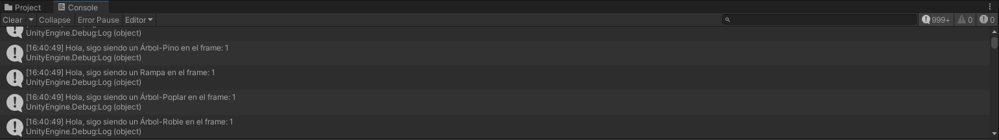
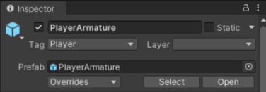
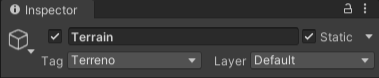
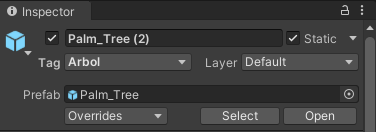
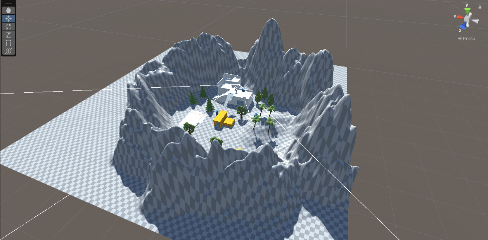
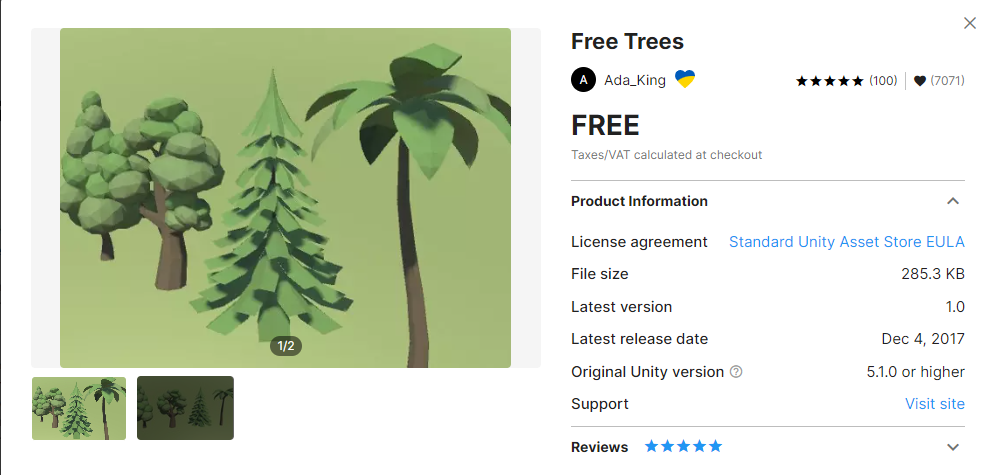

# II-Raimon-Mejias-P01-Introduccion-Unity
Repositorio que contiene los scripts realizados y un README con la descripción del trabajo de la práctica

## Descripción del trabajo realizado

### GIF demostrativo de la práctica


### Script para escribir por consola

Resultados obtenidos en la consola: 




Siguiendo las instrucciones de la clase práctica realizada anteriormente, se propone realizar un pequeño script introductorio que escriba por consola el objeto al cual se le ha añadido dicho componente, de manera adicional se ha añadido la cantidad de frames en los que se ejecuta el script. 

```C#
public class p01_script : MonoBehaviour {
    private int frame = 0; // Cantidad de frames ejecutados
    public string type = "Default"; // El nombre que se va a imprimir por pantalla en la consola

    // Start is called before the first frame update
    void Start()
    {
        Debug.Log($"Hola!, soy un: {type}");
    }

    // Update is called once per frame
    void Update()
    {
        Debug.Log($"Hola, sigo siendo un {type} en el frame: {frame}");
        frame++;
    }
}
```

Se puede observar en el código que se ejecuta un mensaje diferente dependiendo de si es el primer frame en el que se ejecuta el script o son los siguientes. 

### Etiquetas en los objetos de la escena

Siguiendo las indicaciones de la práctica se han añadido una serie de tags para identificar a los objetos, estos son:

- Luz: Indica las fuentes de lu<, para esta práctica solo existe la luz direccional por defecto
- Terreno: Indica todos los objetos que formen parte del terreno, muros, fuertes, rampas, etc.
- Arboles: Indica todos los objetos que sean árboles.

El resto de objetos de la escena utilizan las etiquetas que vienen por defecto en Unity como: Player, MainCamera, etc.




### Creación de un terreno 

De manera opcional se ha creado un objeto Terrain del cual se anidan todo el resto de objetos que formen parte del terreno, como los bloques, las rampas, etc.



### Objeto que no forme parte del Starter Assets

Se ha seleccionado el paquete Free Trees que trae 4 variedades de modelos de árbol. 


